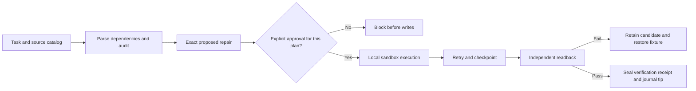

# Governed Agentic Analytics Delivery

A working reference for delivering analytics changes with an explicit approval boundary and independently checkable evidence. The runnable examples trace SQL/report dependencies, find a cross-environment reference, execute an exact approved repair in a local sandbox and verify recovery and final state.

**Author:** [Amir Ebrahim](https://www.linkedin.com/in/amirebrahim/) | Senior Analytics Engineer

The difficult part of agent-assisted delivery is establishing what changed, why it was allowed and whether it worked. Role descriptions alone cannot prove that. This repository pairs the operating model with executable negative-path tests, content-bound plans, checkpoint recovery and a retained verification receipt.

All platform definitions and datasets are synthetic. `prod` and `dev` in the catalog are labels on invented metadata; execution changes local sandbox files. No employer code, infrastructure IDs, credentials, live systems or private records are included.

## Start here

| Reader | Useful starting point |
|---|---|
| Recruiter or hiring manager | [Generated delivery proof](examples/delivery-demo.json) and the capability table below |
| Analytics engineer | [Eleven SQL checks](scripts/checks.yml), [failure cases](tests/test_negative_path.py), and [SQL lineage](delivery/catalog.py) |
| Data/platform engineer | [Approval and checkpoint implementation](delivery/workflow.py), [integrity checks](delivery/integrity.py), and [delivery tests](tests/test_delivery.py) |

## What works here

| Capability | Demonstration |
|---|---|
| Data correctness | Row counts, key uniqueness/nulls/coverage, referential integrity, values and parent mappings by stable key |
| Dependency analysis | BigQuery-style static SQL with CTEs, aliases, nested queries and comments; transitive impact on report consumers |
| Environment isolation | An invented production-labeled pipeline references a development-labeled source; the audit identifies the affected report |
| Approval binding | An unapproved or changed plan cannot execute; approval covers the exact catalog and dependency changes |
| Bounded execution | Two injected transient failures retry successfully on the third attempt; exhaustion remains partial |
| Crash recovery | A written change interrupted before checkpointing is recognized through its exact write-ahead record and expected state |
| Failed verification | An unapproved extra change fails readback, preserves the failed candidate and restores the working fixture |
| Evidence integrity | Source SHA-256 manifests and a hash-chained journal detect changes against a retained receipt |



## Run it

Python 3.12 or newer is sufficient. No cloud account or model API key is needed.

```text
python -m pip install -r requirements-dev.txt
python scripts/run_audit.py --demo
python -m delivery demo --output artifacts/demo
python -m pytest -q
```

Run from the repository root in PowerShell, Bash or a terminal on macOS/Linux. Use a virtual environment. The demonstration output directory must be new so prior evidence is retained.

The SQL harness passes eleven checks on its clean fixture. The delivery demo first proves that missing approval causes zero sandbox writes. It then shows one environment leak and one affected report, a successful retry, a crash-window recovery and a failed verification that restores the working fixture.

### Inspect the proof

- `artifacts/demo/plan.json`: exact proposed dependency repair and complete before catalog.
- `successful/catalog.json`: corrected working definitions.
- `successful/verified-receipt.json`: final catalog hash, independent audit and journal tip.
- `successful/journal.jsonl`: approval check, attempts, applied operation and readback events.
- `resumed/`: recovery after a write occurred before its checkpoint.
- `rollback/`: retained failed candidate, restored fixture and failure journal.
- `source-manifest.json`: exact source-file bytes rather than a file-size-only check.

[The committed example report](examples/delivery-demo.json) was produced by these commands. It identifies simulated approvals and synthetic inputs explicitly.

## Plan, review and execute separately

```text
python -m delivery audit delivery/fixtures/catalog.json
python -m delivery plan delivery/fixtures/catalog.json --output artifacts/review/plan.json
python -m delivery approve artifacts/review/plan.json --actor demo-reviewer --output artifacts/review/approval.json
python -m delivery execute artifacts/review/plan.json --approval artifacts/review/approval.json --output artifacts/manual-sandbox
python -m delivery verify artifacts/manual-sandbox
```

The first audit exits `1` because the fixture intentionally contains an environment leak. Read the proposed change before approving it. The approval file is an explicit local attestation, not an authenticated production authorization service. The fully scripted demo labels its approver `synthetic-demo-reviewer`.

Exit code `0` means the requested operation completed. Code `1` means an unhealthy audit, blocked/partial execution or failed verification. Argument errors use code `2`.

## The data-quality harness

The original four-check harness caught row loss, orphan items and null prices. It could miss same-count duplicates, changed prices and an incorrect parent that happened to exist. It now checks:

1. Source/fact row counts at each grain.
2. Item and order key uniqueness, nulls and bidirectional coverage.
3. Orphan order items.
4. Null prices.
5. Item prices and parent IDs against source records by stable key.

The failure suite includes offsetting price errors whose aggregate total remains correct. This is why value-level reconciliation is separate from row-count and total-value checks. [Twelve harness tests](tests/test_negative_path.py) run clean and corrupted fixtures.

The SQL currently targets SQLite; a warehouse adapter must translate dialect-specific null-safe comparisons and bind the actual source/target tables. `connect()` remains an explicit extension point, not a claimed implemented cloud connector.

## Lineage and impact analysis

[The catalog](delivery/fixtures/catalog.json) describes sources, a pipeline, a fact table, views and a report. View dependencies are parsed with SQLGlot scope analysis, so a CTE name, table alias, comment or string literal is not mistaken for an external source. Declared platform dependencies complete the graph between layers.

Missing assets, unparsed SQL and cycles remain explicit issues and block automatic repair planning. Environment repair uses a unique logical counterpart with the same kind in the target environment. Ambiguity fails. SQL reference changes require their own reviewed SQL proposal; the code does not replace substrings heuristically.

Operational source categories come from declared fixture metadata. The output does not claim to discover an unknown organization's real source systems or prove live permissions, refresh completion or rendered dashboard correctness.

## Agents and the executable boundary

The [role definitions](agents/) and [runbooks](skills/) describe how an investigator, orchestrator, execution role and verifier divide responsibility. They can be used by different capable agent runtimes. The executable implementation here is deterministic Python and SQL; it does not invoke LLMs, spawn autonomous agents or contact MCP/cloud servers.

An agent or person can produce a proposal, but execution still needs the exact approved artifact and verification can fail it. Models are selected for the task; [routing guidance](docs/model-routing.md) does not prescribe a fixed inexpensive worker tier or claim unmeasured cost savings.

## Integrity and recovery limits

The local workflow has a single writer. Atomic working-file replacement, write-ahead events and reconstructed checkpoint state support recovery in the tested crash window. Failed candidates and before-state evidence are retained; only the current synthetic working fixture is restored.

Journal hashes detect edits, reordering, truncation or extra events **against the independently retained receipt tip**. They do not authenticate an approver or prevent an attacker who can rewrite both journal and receipt from forging local history. A production service needs trusted identity, an external immutable approval/receipt store, concurrency control, provider-specific idempotency/readback and explicit promotion authority.

[Architecture and contracts](docs/architecture.md) explain supported operations and unresolved cases. [Governance](GOVERNANCE.md) distinguishes the implemented local demonstration from the enterprise promotion pattern. [The older deployment plan](plans/deployment_plan_example.md) is illustrative; the CLI produces current content-bound plans and approvals.

## Repository map

```text
delivery/        static SQL lineage, environment audit, plan/execute/verify and journal
  fixtures/      invented platform definitions
scripts/         independent SQLite data-quality harness and declarative checks
tests/           negative data cases, parser behavior, approval, recovery and integrity
examples/        command-generated demonstration evidence
agents/          conceptual role interfaces for agent-assisted work
skills/          sanitized runbooks
plans/           implementation and illustrative approval artifacts
models/          illustrative dbt-style models, not a separate warehouse
docs/            architecture and model-routing choices
```

Related work: [dbt and BigQuery warehouse](https://github.com/PharaohFresh/analytics-engineering-portfolio) | [query optimizer](https://github.com/PharaohFresh/governed-query-optimizer) | [booking revenue reconciliation](https://github.com/PharaohFresh/revenue-reconciliation-pipeline). [MIT license](LICENSE).
