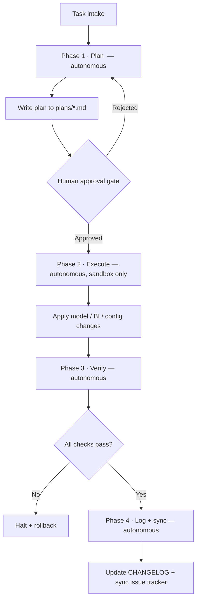

# Governed Agentic Analytics-Engineering Delivery

A reference architecture for shipping analytics-engineering changes — data models,
BI report updates, issue-tracker sync — with **AI agents as accountable
accelerators behind a human approval gate**, not autonomous actors.

This repo is the *pattern*, fully genericized: a multi-agent system that **plans →
waits for human approval → executes → verifies → logs**. It is the operating model
I run for real delivery work, stripped of anything proprietary and rebuilt against
generic placeholders so the design can stand on its own.

> Companion repo: a working dbt + BigQuery warehouse that this delivery model
> operates on lives at
> [`analytics-engineering-portfolio`](https://github.com/PharaohFresh/analytics-engineering-portfolio).

## Why this exists

Most "AI + data" demos hand an agent write access and hope. The hard part isn't
getting an LLM to write SQL — it's making automated changes that a data team can
*trust*. That means: a plan a human signs off on before anything mutates,
execution scoped to a sandbox, an independent verification pass that can fail the
run, and an append-only log of what actually happened. This repo encodes those
guardrails as structure.

## The flow



**The only human touch point is the approval gate** (and rejection loops back to
re-plan). Everything else — exploration, planning, execution against the sandbox,
verification, logging — runs autonomously, because each phase is bounded by the
phase before it.

## The agents

| Agent | Phase | Responsibility | Mutates? |
|---|---|---|---|
| [Orchestrator](agents/orchestrator.md) | all | Owns the task, writes the plan, holds the approval gate, compiles logs | no (delegates) |
| [Investigator](agents/investigator.md) | plan | Read-only scan of repo, schemas, docs, and references for context | no |
| [Execution Engine](agents/execution-engine.md) | execute | Applies approved mutations to models / BI / config | yes (sandbox) |
| [Verification Analyst](agents/verification-analyst.md) | verify | Independent audits: row reconciliation, grain, freshness | no |

## What's in here

```
agents/        role definitions + the universal guardrails (AGENTS.md)
configs/       MCP server wiring by capability (template, no secrets)
skills/        declarative runbooks the agents execute (+ the format spec)
plans/         example human-in-the-loop approval artifact
scripts/       generic verification harness (runs against a SQLite demo fixture)
models/        illustrative dbt-style models the pattern operates on
docs/          full sanitized architecture write-up
GOVERNANCE.md  environment separation, no-deletion policy, rollback, promotion
```

## Run the verification harness

The verification layer is the part worth seeing work. It runs out of the box
against a tiny SQLite fixture — no warehouse, no credentials:

```bash
pip install -r requirements.txt
python scripts/run_audit.py --demo
```

It loads checks from [`scripts/checks.yml`](scripts/checks.yml), runs each as a
single-value assertion, and exits non-zero if any fails. Point it at a real
warehouse by implementing one `connect()` function — the checks are declarative
and warehouse-agnostic.

## Tech stack (generic)

- **Agent runtime + Model Context Protocol (MCP)** for tool access
- **Python** for the verification harness
- **dbt + a SQL warehouse** as the transformation/target layer
- **Markdown + YAML** for agents, skills, plans, and config

---
*Built by Amir Ebrahim — senior analytics engineer. [linkedin.com/in/amirebrahim](https://linkedin.com/in/amirebrahim)*
